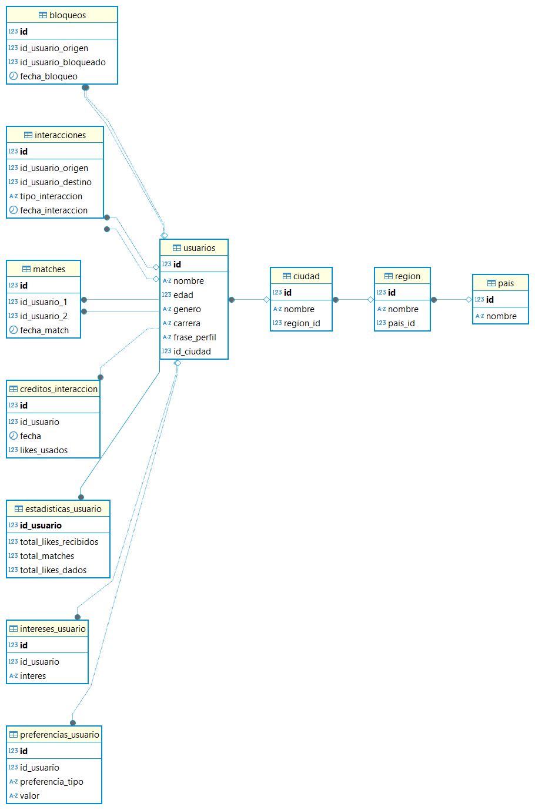

# 🌟 LoveCampus - Sistema de Emparejamiento 

LoveCampus es una aplicación de consola en C# diseñada para facilitar conexiones entre estudiantes de Campus. Implementa un sistema de matchmaking similar a las aplicaciones de citas, pero enfocado en el ámbito de Campus, permitiendo a los estudiantes conocer a otros con intereses similares.

## 📊 Arquitectura del Proyecto

El proyecto está organizado siguiendo los principios de la **Arquitectura Limpia (Clean Architecture)**, lo que permite una separación clara de responsabilidades y facilita el mantenimiento y la escalabilidad:

```
LoveCampus/
├── application/        # Servicios y casos de uso de la aplicación
│   ├── Services/       # Implementación de la lógica de negocio
│   └── UI/             # Interfaces de usuario para interactuar con los servicios
├── domain/             # Núcleo de la aplicación
│   ├── Entities/       # Modelos de datos y entidades de negocio
│   └── Ports/          # Interfaces que definen los contratos de repositorios
├── infrastructure/     # Implementaciones concretas
│   ├── Mysql/          # Repositorios que interactúan con MySQL
│   └── Repositories/   # Implementaciones de los repositorios
└── Program.cs          # Punto de entrada de la aplicación
```

## 🗃️ Estructura de la Base de Datos

La aplicación utiliza MySQL como sistema de gestión de base de datos. Las principales tablas incluyen:

- **cuentas**: Almacena información de autenticación (email, contraseña hasheada)
- **usuarios**: Datos personales de los usuarios vinculados a las cuentas
- **interacciones**: Registra los likes entre usuarios
- **matches**: Almacena las coincidencias cuando dos usuarios se dan like mutuamente
- **creditos_interaccion**: Gestiona los créditos diarios para dar likes
- **estadisticas_usuario**: Almacena estadísticas de uso
- **preferencias_usuario**: Preferencias de búsqueda de cada usuario
- **intereses_usuario**: Intereses y hobbies de los usuarios
- **ciudades**, **regiones**, **paises**: Datos geográficos para la ubicación de usuarios

## 📋 Requisitos Previos

- [.NET Core 8.0 SDK](https://dotnet.microsoft.com/download)
- [MySQL Server](https://dev.mysql.com/downloads/mysql/) (versión 8.0 o superior)
- [Visual Studio Code](https://code.visualstudio.com/) o Visual Studio

### Paquetes NuGet requeridos:
- MySql.Data
- BCrypt.Net-Next

## 🏃‍♂️ Instalación y Configuración

1. **Clona el repositorio:**
```bash
git clone https://github.com/OscarAndres2823/LoveCampus.git
```

2. **Restaura las dependencias:**
```bash
dotnet restore
```

3. **Configura la base de datos MySQL:**
   - Crea una base de datos llamada `love`
   - Configura un usuario con acceso a esta base de datos
   - Actualiza la cadena de conexión en `infrastructure/Mysql/ConexionSingleton.cs` con tus credenciales
   

4. **Ejecuta la aplicación:**
dotnet run

## 🎮 Funcionalidades Detalladas

### 1. Sistema de Autenticación

- **Registro de Usuarios:**
  - Creación de cuenta con email y contraseña
  - Registro de datos personales (nombre, edad, género, ubicación)
  - Las contraseñas se almacenan de forma segura utilizando BCrypt

- **Inicio de Sesión:**
  - Autenticación mediante email y contraseña
  - Validación de credenciales contra la base de datos

### 2. Gestión de Perfiles

- **Visualización de Perfiles:**
  - Exploración de perfiles de otros usuarios
  - Filtrado inteligente para mostrar perfiles compatibles

- **Edición de Perfil:**
  - Actualización de información personal
  - Gestión de intereses y preferencias

### 3. Sistema de Interacciones

- **Likes y Matches:**
  - Cada usuario dispone de 10 créditos diarios para dar likes
  - Los créditos se renuevan automáticamente cada día
  - Cuando dos usuarios se dan like mutuamente, se genera un match

- **Gestión de Matches:**
  - Visualización de coincidencias (matches)
  - Historial de interacciones

### 4. Sistema de Créditos

- **Asignación Diaria:**
  - 10 créditos diarios por usuario
  - Reinicio automático a las 00:00 horas

- **Control de Uso:**
  - Seguimiento del uso de créditos
  - Notificaciones cuando los créditos están por agotarse

### 5. Estadísticas del Sistema

- **Estadísticas Globales:**
  - Usuarios más populares
  - Número total de matches
  - Distribución de usuarios por ubicación

- **Estadísticas Personales:**
  - Likes recibidos
  - Matches conseguidos
  - Historial de actividad

### 6. Gestión de Datos Geográficos

- **Administración de Ubicaciones:**
  - Gestión de países, regiones y ciudades
  - Filtrado de perfiles por proximidad geográfica

## 🔒 Seguridad

- **Protección de Datos:**
  - Contraseñas hasheadas con BCrypt
  - Validación de entradas para prevenir inyecciones SQL

- **Control de Acceso:**
  - Sesiones de usuario
  - Protección contra accesos no autorizados

## 🛠️ Arquitectura Técnica

- **Patrón Repositorio:**
  - Separación clara entre la lógica de negocio y el acceso a datos
  - Interfaces bien definidas para facilitar pruebas unitarias

- **Inyección de Dependencias:**
  - Los servicios reciben sus dependencias a través del constructor
  - Facilita el testing y la sustitución de implementaciones

- **Servicios Especializados:**
  - Cada entidad tiene su propio servicio con responsabilidades específicas
  - Separación clara de preocupaciones

## 📝 Notas Importantes

- La aplicación está diseñada para ejecutarse en un entorno de consola interactiva
- Los datos se persisten en MySQL, lo que permite mantener la información entre sesiones
- El sistema de créditos diarios evita el uso excesivo y promueve interacciones de calidad

---

Made with ❤️ by OscarAndres2823
